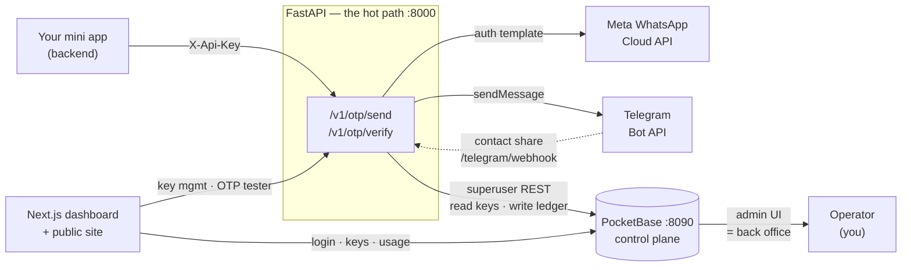

<div align="center">

# WA OTP

**Verify a phone number with two API calls — over WhatsApp or Telegram.**

Self-hostable · No DLT registration · Telegram is free forever

[](https://www.gnu.org/licenses/agpl-3.0)
[](https://fastapi.tiangolo.com)
[](https://pocketbase.io)
[](https://nextjs.org)

</div>

---

WA OTP is an OTP delivery gateway built for people shipping small apps in India — the bhajan app, the housing-society app, the senior-citizen helpline. Their users know WhatsApp and do not use email, so phone verification is the only verification that works.

The problem is that phone verification is a wall for a solo developer. SMS needs DLT registration. WhatsApp Business has onboarding, per-message pricing, and documentation written for companies. Neither fits someone who just wants to confirm a phone number in a weekend project.

WA OTP is that piece, extracted and made self-hostable.

> [!NOTE]
> **The code is open source. Your data is not.** A self-hosted instance keeps every phone number, message, and API key inside your own PocketBase. Nothing talks to us, because there is no "us" in the loop — see [Privacy](#privacy).

## Contents

- [What you get](#what-you-get)
- [Architecture](#architecture)
- [The two channels](#the-two-channels)
- [Self-hosting](#self-hosting)
- [API reference](#api-reference)
- [Project layout](#project-layout)
- [Privacy](#privacy)
- [Contributing](#contributing)
- [Security](#security)
- [License](#license)

## What you get

Two endpoints. That is the whole integration.

```bash
# 1. Send a code
curl -X POST https://api.example.in/v1/otp/send \
  -H 'X-Api-Key: YOUR_API_KEY' \
  -H 'Content-Type: application/json' \
  -d '{"to": "919876543210", "channel": "whatsapp"}'
```

```json
{
  "ok": true,
  "mode": "platform",
  "channel": "whatsapp",
  "request_id": "req_8f2c1a",
  "wa_message_id": "wamid.HBgM...",
  "expires_in": 300,
  "free_used": 42,
  "free_limit": 500,
  "reset_utc": "2026-10-01T00:00:00Z"
}
```

```bash
# 2. Check the code the user typed in
curl -X POST https://api.example.in/v1/otp/verify \
  -H 'X-Api-Key: YOUR_API_KEY' \
  -H 'Content-Type: application/json' \
  -d '{"to": "919876543210", "code": "123456"}'
```

```json
{ "ok": true, "verified": true }
```

The code is generated for you unless you pass your own. It lives 5 minutes, survives 3 wrong guesses, and is single-use. Your server calls this API — never the browser (see [Security](#security)).

## Architecture



FastAPI owns every decision. PocketBase is storage plus a back office.

- **PocketBase is never exposed to customers.** It is bound to localhost (or a firewalled port) and only FastAPI — authenticated as a superuser — and your own browser ever reach it. A leaked API key can send OTPs; it cannot read the database.
- **All quota, throttle, and limit logic lives in FastAPI**, so the failure modes are typed HTTP errors you can actually handle, not opaque JSVM behaviour.
- **PocketBase earns its place as the back office.** Its admin UI is your operator dashboard on day one — every send, every failure, every ledger row, with no code written for it.
- **Limits are data, not code.** The single `settings` row holds the quota, throttle, TTL, attempt count, and rate limits. Change them in the admin UI; no redeploy.

## The two channels

| | WhatsApp | Telegram |
|---|---|---|
| **Cost** | 500 delivered OTPs/month free | **Unlimited, ₹0 forever** |
| **Reach** | Universal — works for anyone with a phone | Requires the user to start the bot once |
| **Setup** | Meta developer app + `verification_code` template | `@BotFather` and one webhook call |
| **Good for** | Everyone, especially non-technical users | Testing, developer audiences, high-volume flows |

The Telegram channel is what makes the free tier honest. The Bot API has no message quota, so it costs the operator nothing no matter how much it is used. That is the cost valve that lets WhatsApp stay free for the people who need it.

### Quota semantics

These trip people up, so they are worth reading twice:

- The monthly quota counts **WhatsApp-delivered sends only**. Telegram never consumes it.
- **Failed sends never consume quota.** They are logged with `status=failed` so you still have the audit trail.
- The **per-phone hourly throttle applies to both channels.** It exists to stop someone burning your quota on one victim's number, and that risk is identical on Telegram.
- The **per-key rate limit applies to both channels** too.

Default limits, all editable in the `settings` row:

| Control | Default |
|---|---|
| WhatsApp OTPs / developer / month | 500 |
| OTPs / phone / hour (both channels) | 5 |
| Code TTL | 300 s |
| Verification attempts per code | 3 |
| Requests / minute / API key | 10 |
| Active API keys / owner | 5 |

## Self-hosting

Two processes: the FastAPI backend and PocketBase. The Next.js dashboard is optional — the API works without it.

### 1. PocketBase

WA OTP pins **PocketBase v0.40.x**. The JSVM migration uses the v0.40 collection and field API, and declares `created`/`updated` as explicit `autodate` fields — without that, indexes on those fields fail to build. Do not upgrade past v0.40.x without updating the migration.

The binary is **not** in this repository (it is ~40 MB and platform-specific). Download the v0.40.x release for your platform from [pocketbase/pocketbase/releases](https://github.com/pocketbase/pocketbase/releases) and place it at `backend/pocketbase/pocketbase`.

```bash
cd backend/pocketbase
./pocketbase superuser upsert you@local devpass123
./pocketbase serve --http=127.0.0.1:8090   # admin UI at http://127.0.0.1:8090/_/
```

### 2. Backend

```bash
cd backend

python3 -m venv .venv
.venv/bin/pip install -r requirements-dev.txt

cp .env.example .env
# Generate the key that encrypts your Meta token at rest:
.venv/bin/python -c "from cryptography.fernet import Fernet; print(Fernet.generate_key().decode())"

.venv/bin/uvicorn app.main:app --port 8000   # OpenAPI docs at http://127.0.0.1:8000/docs

# Create a developer account and an API key
.venv/bin/python scripts/seed_dev.py dev@waotp.local devpass123
```

> [!TIP]
> **`WAOTP_MOCK_DELIVERY=1` is the best thing about developing against this.**
>
> It fakes provider delivery while keeping **every database row real** — the whole send → verify → quota → throttle → ledger flow runs with no Meta account, no Telegram bot, and no credentials of any kind. You get a complete, honest integration test with zero setup.
>
> It must be `0` or absent in production.

Set `DASHBOARD_ORIGIN` to your dashboard's origin (e.g. `http://localhost:3000`). Without it, CORS blocks every browser call to the API — and the failure looks like a dead backend rather than a config mistake.

### 3. Dashboard (optional)

```bash
cd frontend

bun install
cp .env.local.example .env.local   # fill in the PocketBase and API URLs
bun dev                            # http://localhost:3000
```

`NEXT_PUBLIC_PB_COLLECTIONS_PREFIX` must match `WAOTP_PB_COLLECTIONS_PREFIX` on the backend.

### Sharing one PocketBase across projects

If you already run PocketBase for something else, you do not need a second instance. Set a prefix and WA OTP namespaces itself:

```bash
WAOTP_PB_COLLECTIONS_PREFIX=waotp_          # backend/.env
NEXT_PUBLIC_PB_COLLECTIONS_PREFIX=waotp_    # frontend/.env.local
```

With a prefix set, collections become `waotp_api_keys`, `waotp_messages`, and so on — **and WA OTP creates its own `waotp_users` auth collection instead of touching the stock `users` collection.** Developer accounts, tokens, and data stay completely separate from the other project on the instance.

> [!WARNING]
> Never leave the prefix empty when pointing at a shared instance. An unprefixed build addresses the stock `users` and `api_keys` collections — which belong to the other project.

Provision it:

```bash
.venv/bin/python scripts/provision_pb.py \
    --url https://pb.example.com \
    --email you@example.com --password '***'
```

The script is idempotent by design: **existing collections are never modified.** Running it twice is safe. Keep it that way.

For a dedicated single-app deployment, leave the prefix empty — the JS migration creates logical collection names and extends the stock `users` collection with `plan` and `status`.

### Going live

Secrets are read from the PocketBase `settings` row, not from the environment, so going live needs no redeploy.

1. **Meta:** create an app → WhatsApp → test number + token, then create the `verification_code` authentication template (en_US, `{{1}}` in the body plus a Copy Code button). While on the test number, only your allow-listed recipients receive anything — a natural sandbox.
2. **Encrypt the token into `settings`:**
   ```bash
   .venv/bin/python -c "from app.core.security import encrypt_secret; print(encrypt_secret('YOUR_META_TOKEN'))"
   ```
   Paste the result into `meta_token_enc` in the admin UI and fill in `meta_phone_number_id`.
3. **Telegram:** create the bot with `@BotFather`, store `tg_bot_token` and `tg_bot_username` in `settings`, then:
   ```bash
   .venv/bin/python scripts/set_telegram_webhook.py https://api.example.in
   ```
4. Set `WAOTP_MOCK_DELIVERY=0`.

> [!IMPORTANT]
> **Run a single uvicorn worker.** A per-key `asyncio` lock wraps each send (quota check → provider delivery → ledger writes) and a per-(owner, phone) lock wraps each verify. Those locks are what stop a concurrent double-spend of quota and duplicate verification of one code. Adding a second worker silently breaks both. If you need horizontal scale, move the locking to a shared store first.

## API reference

Base path `/v1`. OTP routes authenticate with `X-Api-Key`; dashboard routes use `Authorization: Bearer <PocketBase user token>`.

| Method | Path | Auth | Purpose |
|---|---|---|---|
| `POST` | `/v1/otp/send` | API key | Send a code. Accepts an optional `Idempotency-Key` header — replays are deduped for the code's lifetime |
| `POST` | `/v1/otp/verify` | API key | Verify a code. Single-use |
| `GET` | `/v1/otp/usage` | API key | `{plan, used, limit, reset_utc}` |
| `GET` `POST` | `/v1/keys` | PB token | List masked keys / issue one (`201`, plaintext shown **once**) |
| `POST` | `/v1/keys/regenerate` | PB token | Deactivate the old key, issue a new one |
| `DELETE` | `/v1/keys/{id}` | PB token | Retire a key (soft delete) |
| `GET` | `/v1/usage` | PB token | Dashboard usage view |
| `POST` | `/telegram/webhook` | secret header | `/start` + contact share → `tg_links` |
| `GET` | `/v1/health` | — | `200` when PocketBase is reachable, `503` otherwise |

`POST /v1/keys/deactivate` is a deprecated alias of `DELETE /v1/keys/{id}`, kept for existing clients.

### Errors

Every error is `{"ok": false, "error": "<code>", ...}`.

| Status | Codes |
|---|---|
| `400` | bad input |
| `401` | bad key or token |
| `403` | key disabled |
| `404` | `key_not_found` |
| `409` | `user_not_linked` (carries `link_url`), `key_limit_reached` |
| `429` | `quota_exceeded`, `phone_throttled`, `rate_limited` |
| `502` | `delivery_failed` (carries `retryable`) |
| `503` | `not_configured`, `upstream_unavailable` |
| `500` | `internal_error` |

`429` responses carry `Retry-After`: `60` for the per-key rate limit, `3600` for the per-phone throttle, or the seconds until the monthly reset for `quota_exceeded`. Validation errors return a whitelisted `detail: [{loc, msg, type}]` — raw input is never echoed back.

<details>
<summary><strong>Telegram link flow</strong> (why Telegram needs one extra step)</summary>

Telegram bots cannot message someone who has never started them. So the first Telegram send for an unlinked number returns a deep link instead of a message:

1. `/v1/otp/send` with `channel: "telegram"` → `409 {"error": "user_not_linked", "link_url": "https://t.me/<bot>?start=<signed token>"}`
2. Your app shows a **Connect Telegram** button opening that URL.
3. The bot replies with a *share contact* keyboard.
4. The shared contact is accepted **only if `contact.user_id == from.id`** — otherwise anyone could share a friend's number and receive their OTPs.
5. The link is stored in `tg_links`; retry the send and the OTP arrives on Telegram.

Linking is platform-wide: a user links once and every developer's Telegram OTP reaches them.

</details>

<details>
<summary><strong>Known limitation: ledger write after successful delivery</strong></summary>

If the PocketBase ledger write fails *after* Meta accepted the message, the API returns `502 delivery_failed` with `retryable: false` and logs the `wa_message_id` for manual reconciliation. An automatic retry may double-send. Clients that care about this can send an `Idempotency-Key` header to make retries safe.

</details>

Full integrator reference: [`backend/docs/api.md`](backend/docs/api.md). Error bodies are declared on every route in the OpenAPI spec, served at `/docs`.

## Project layout

```
backend/
  app/
    core/        config (env) · security (sha256, Fernet, link tokens) · error types
    services/    PocketBase REST client · settings cache · quota/throttle ·
                 otp store · Meta Cloud API · Telegram Bot API
    routers/     otp · keys + dashboard usage · telegram webhook · health
    dependencies.py   auth · rate limiter · idempotency store · asyncio locks
  pocketbase/    binary + pb_migrations (8 collections) + pb_data (runtime, gitignored)
  scripts/       seed_dev.py · provision_pb.py · set_telegram_webhook.py
  tests/         pytest suite (in-memory FakePB, mock delivery)
  docs/api.md    integrator API reference

frontend/
  src/app/       (auth) · dashboard (overview, keys, tester, settings) · docs · landing
  src/features/  feature modules — auth, dashboard, keys, tester
  src/components/  shadcn/ui + field components + icon registry
  src/lib/       PocketBase client · API client · form hook

PRD.md           the canonical specification — read this first
```

[`PRD.md`](PRD.md) is the source of truth for architecture, data model, API semantics, and limits. When documentation and code disagree, PRD.md wins.

## Privacy

This software does not phone home. There is no telemetry, no analytics, no license check, and no call to any server other than the ones you configure. A self-hosted instance sends OTPs through *your* Meta and Telegram credentials and stores everything in *your* PocketBase.

OTP codes and API keys are stored as sha256 hashes, never in plaintext. API keys are displayed exactly once, at creation.

The dashboard ships with Sentry **inert** — no DSN is configured and nothing initialises it — so a default build reports to nowhere. Turn it on only if you want it.

## Contributing

Issues and pull requests are welcome — see [`CONTRIBUTING.md`](CONTRIBUTING.md). If you are planning anything non-trivial, please read `PRD.md` first and open an issue; it will save us both a rewrite.

## Security

Please do **not** open a public issue for a vulnerability. See [`SECURITY.md`](SECURITY.md) for the private reporting channel and an operator hardening checklist.

> [!WARNING]
> Never commit a `.env` file. If a secret does leak, **rotate it** — deleting the file is not enough, because git history keeps it and scrapers find it within seconds of a push.

## License

**AGPL-3.0-or-later** — see [`LICENSE`](LICENSE).

What that means in practice, because this is the part people get wrong:

- **Self-hosting an unmodified copy carries no obligation to publish anything.** Run it privately, run it commercially, run it for your own paying customers. Modify it for your own use and keep those modifications to yourself. None of that triggers AGPL.
- **AGPL-3.0 §13** applies only when you *modify* WA OTP **and** run the modified version as a network service for other people. Those users must be offered the modified source. See [§13, Remote Network Interaction](https://www.gnu.org/licenses/agpl-3.0.html#section13).
- This is deliberate. It keeps WA OTP forkable and self-hostable for anyone, while preventing a closed-source hosting business from being built out of other people's contributions.
- **No open-source license grants trademark rights.** The WA OTP name and logo remain with the project; forks are welcome but should not present themselves as the official service.

### Mixed licensing

The frontend began from a shadcn/ui admin dashboard starter kit by [Kiranism](https://github.com/Kiranism), which is **MIT licensed**. That notice is preserved at [`frontend/LICENSE`](frontend/LICENSE) and remains in force for the portions derived from it. MIT is compatible with the AGPL, so the project as a whole is distributed under AGPL-3.0-or-later with those MIT portions intact.

### Acknowledgements

Built on [Meta's WhatsApp Cloud API](https://developers.facebook.com/docs/whatsapp/cloud-api), the [Telegram Bot API](https://core.telegram.org/bots/api), [PocketBase](https://pocketbase.io), [FastAPI](https://fastapi.tiangolo.com), [Next.js](https://nextjs.org), and [shadcn/ui](https://ui.shadcn.com). The frontend scaffold descends from Kiranism's admin dashboard starter.

---

<div align="center">
<sub>Built for the developer with a ₹50 UPI top-up and a weekend.</sub>
</div>
