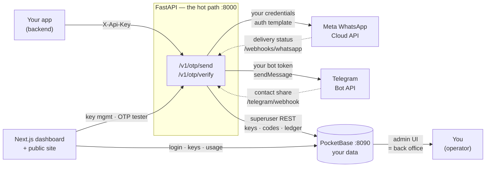

<div align="center">

# WA OTP

**Self-hosted OTP delivery over WhatsApp or Telegram. Two API calls: send a code, check a code.**

Open source · Self-hostable · You bring your own WhatsApp Business account

[](https://www.gnu.org/licenses/agpl-3.0)
[](https://www.gnu.org/licenses/agpl-3.0)
[](https://fastapi.tiangolo.com)
[](https://pocketbase.io)
[](https://nextjs.org)
[](#development)

</div>

---

## What this is

WA OTP is free, open-source software you run yourself. You clone it, point it at **your own** database and **your own**
WhatsApp Business account (or your own Telegram bot), and it sends and verifies phone-number codes for
whatever app you are building.

Your server calls it. Your users receive the code. Every phone number, message, API key and audit row
lives in your database.

> [!NOTE]
> **Free & Open Source Forever (AGPL-3.0)**
> This software is 100% free and open-source forever. There are no paid enterprise editions, no paywalled features, no SaaS subscriptions, and no vendor lock-in. You own your code, run your own containers, and keep all your user data completely under your control.

> [!IMPORTANT]
> **This project provides the software only. It does not provide WhatsApp messaging infrastructure, WhatsApp Business accounts, Meta credentials, phone numbers, hosting, or message credits.**

That sentence is the whole business model, so it is worth being blunt about what it means:

- There is **no hosted version of this**. Nobody operates a wa-otp service for you to sign up to.
- There is **no shared WhatsApp number, bot, or Meta account.** The code contains none, and there is no
  code path that could reach one.
- There is **nothing to pay this project.** There is also nothing to pay for the software — the licence
  is free and there is no billing code in the repository.
- **WhatsApp messaging itself is not free.** Meta charges for WhatsApp Business messages. That is a
  commercial relationship between you and Meta, and this project has no part in it.
- Running this costs whatever your server and your Meta usage cost. For a small app that is often close
  to nothing; it is not zero by definition, and this README will not pretend otherwise.

## The eleven questions

### 1. What do I actually get?

Source code, and a Docker Compose file that starts the whole thing. The API (`/v1/otp/send`,
`/v1/otp/verify`), a PocketBase instance for data and the operator back office, and a Next.js dashboard
you use to see what your installation is doing.

### 2. Do I need my own WhatsApp Business account?

**Yes — for WhatsApp.** There is no way around this, and anything claiming otherwise is misleading you
about how Meta works. WhatsApp Business messages can only be sent by a Meta Business Account that owns
the sending phone number and an approved message template. That account must be **yours**: the app reads
your credentials from your environment and calls Meta as you.

Full walkthrough: [`docs/meta-setup.md`](docs/meta-setup.md).

### 3. Is there a channel that doesn't need Meta?

**Yes — Telegram.** A Telegram bot needs one token from `@BotFather`, no business verification, no
payment method, and no approval process. The trade-off is that a Telegram bot can only message someone
who has started it once, so a first-time send returns a one-tap link instead of the code (see
[the link flow](#the-telegram-link-flow)). If you want to evaluate this software today without touching
Meta at all, start with Telegram.

### 4. Does WhatsApp messaging cost money?

**Yes.** Meta bills for WhatsApp Business messages on its own schedule and its own rates, and it decides
those, not this project. Read [Meta's pricing](https://developers.facebook.com/docs/whatsapp/pricing)
before you plan a launch. This project does not resell messaging, bundle credits, or intermediate
payments in any way — you pay Meta directly, if Meta charges you.

### 5. What do I need to run it?

A machine that stays on and can run Docker — a small VPS, a spare box at home, a NAS. Plus two
hostnames on a domain you control if you want HTTPS (one for the API, one for PocketBase). No Postgres,
no Redis, no queue, no object storage: PocketBase embeds its own SQLite database and the API holds its
state in-process.

### 6. Anything I have to sign up for with *you*?

**No.** There is no account with this project, no API key issued by this project, no licence check, no
usage reporting, and no service of ours in the request path. There is no author-owned server for the
software to depend on, by design — see
[question 11](#11-what-happens-if-this-repository-or-its-authors-disappear).

### 7. Where does my data live?

In your PocketBase instance, on your disk, in `pb_data/`. Phone numbers, message audit rows, API key
hashes, linked Telegram accounts, and your settings. Nothing is sent anywhere except to the provider you
configured (Meta and/or Telegram) and back to your own dashboard, which talks to your own API.

### 8. Does it phone home? Is there telemetry?

**None.** No analytics, no crash reporting, no version check, no "anonymous usage statistics", no
licence call. The dashboard ships with Sentry **inert** — no DSN is compiled in and nothing initialises
it. A default build reports to nowhere. If you want error reporting you can point it at **your own**
Sentry project.

### 9. Is it secure?

The security-relevant properties are documented and each one is tied to where it is implemented — see
[`SECURITY.md`](SECURITY.md) and the [security notes](#security) below. What is true: OTP codes and API
keys are stored as SHA-256 hashes, never plaintext; codes are generated with a CSPRNG; codes are
single-use and attempt-limited; the Meta token is encrypted at rest with Fernet; the API is
rate-limited per key, per IP and per phone number; and no secret is ever logged or returned in a
response.

What is equally true: **you are the operator, so you own the remaining risk.** Terminate TLS, keep your
`.env` off version control, back up `pb_data/`, and keep PocketBase off the public internet.

### 10. Can I use it commercially?

**Yes.** AGPL-3.0-or-later. Running it for paying customers is fine and carries no obligation to publish
anything, as long as you have not modified it. Details — including the one case that does trigger
§13 — are in [License](#license).

### 11. What happens if this repository or its authors disappear?

**Nothing breaks.** This is a hard requirement of the design, and here is why it holds:

- No hostname, token, or account belonging to the authors appears in the code. Not in a default, not in
  a fallback, not in a comment. `grep -ri codaipro .` returns nothing.
- There is no call to any service other than the ones you configure: your PocketBase, your Meta app, your
  Telegram bot.
- Nothing is fetched at boot — no licence server, no config endpoint, no telemetry endpoint.
- The images build from this checkout. There is no prebuilt image to be delisted.
- The one external dependency is the PocketBase release binary, which the Dockerfile downloads from
  GitHub and verifies against the published checksums. That is PocketBase's release, not ours; a fork
  could also vendor the binary, and the manual install path explicitly does.

If this repository vanished tomorrow, your installation would keep sending OTPs, and your fork would keep
working. Pinning your own fork is the recommended state, not a fallback.

## Architecture



FastAPI owns every decision. PocketBase is storage plus a back office.

- **PocketBase is never exposed to your customers.** Only FastAPI (authenticated as a superuser) and
  your own browser ever reach it. A leaked API key can spend your send quota; it cannot read your
  database.
- **All quota, throttle and limit logic lives in FastAPI**, so failures are typed HTTP errors you can
  handle, not opaque database behaviour.
- **PocketBase earns its place as the back office.** Its admin UI is a complete operator view on day
  one — every send, every failure, every audit row.
- **Limits are data, not code.** A single `settings` row holds the send cap, throttle, TTL, attempt
  count and rate limits. Change them in the admin UI; no redeploy.

## Install

### Docker Compose (recommended)

Three services — the API, PocketBase, and the dashboard — plus a named volume for your data.

```bash
# Clone the repository (use -b feat/self-host to test this self-hosted branch):
git clone -b feat/self-host https://github.com/Luckyyaduvanshiofficial/wa-otp.git wa-otp
cd wa-otp
cp .env.example .env
```

Open `.env` and set, at minimum:

| Variable | What it is |
|---|---|
| `APP_ENV` | `production` on a real install — this turns on the fail-closed checks below |
| `PB_SUPERUSER_EMAIL` / `PB_SUPERUSER_PASSWORD` | the PocketBase superuser; the entrypoint creates it on first boot |
| `SECRET_KEY` | a long random string you generate |
| `WAOTP_FERNET_KEY` | encrypts the Meta token at rest. Generate with the command in the file's header |
| `APP_URL` | the public HTTPS URL of your API. Your webhook URL is derived from it |
| `DASHBOARD_ORIGIN` | the exact origin of your dashboard — no trailing slash |
| `META_*` | your Meta credentials, or leave blank for Telegram-only |

Then:

```bash
docker compose up -d

# Create your operator account — there is no public signup
docker compose exec api python scripts/create_admin.py you@example.com
```

Open the dashboard, sign in, create an API key for your app, and follow
`/dashboard/onboarding` — a seven-step checklist that mirrors the sections below and shows you, live,
which parts of your installation are wired up.

> [!WARNING]
> **`APP_ENV=production` makes the API refuse to boot** if `SECRET_KEY`, `WAOTP_FERNET_KEY` or
> `PB_SUPERUSER_PASSWORD` is missing, or if mock delivery is on. That is deliberate: booting with a
> missing signing key quietly weakens security, and a silent downgrade is worse than no boot at all.

### Without Docker

Run PocketBase, then the API, then the dashboard. Full instructions, including the systemd units and
the reverse-proxy config: [`docs/self-hosting.md`](docs/self-hosting.md).

The short version:

```bash
# 1. PocketBase — download the v0.40.x binary, do not float the version
cd backend/pocketbase
./pocketbase superuser upsert you@local 'a-strong-password'
./pocketbase serve --http=127.0.0.1:8090   # admin UI at http://127.0.0.1:8090/_/

# 2. API
cd backend
python3 -m venv .venv && .venv/bin/pip install -r requirements-dev.txt
cp .env.example .env                       # then fill it in
.venv/bin/uvicorn app.main:app --port 8000
.venv/bin/python scripts/create_admin.py you@example.com

# 3. Dashboard (optional — the API works without it)
cd frontend && bun install && cp .env.local.example .env.local && bun dev
```

> [!TIP]
> **`WAOTP_MOCK_DELIVERY=1` is the fastest way to see the whole thing work.**
>
> It fakes provider delivery while keeping **every database row real** — the full send → verify → quota
> → throttle → audit flow runs with no Meta account, no Telegram bot, and no credentials of any kind.
> You get an honest end-to-end integration test with zero setup.
>
> It must be `0` or absent in production, and the production checks above enforce that.

### Local TLS certificates

Neither the dashboard nor PocketBase should be served over plain HTTP on a real install. PocketBase's
admin UI is the control plane for every credential this app holds. Put both behind a reverse proxy you
manage — Caddy with automatic certificates is the least work — and terminate TLS there.

## Connecting your WhatsApp account

Once, per installation. The full walkthrough with the exact clicks is in
[`docs/meta-setup.md`](docs/meta-setup.md). What you are doing:

1. Create a **Meta app** of type Business, and add the WhatsApp product.
2. Create or connect a **WhatsApp Business Account** and register a **phone number** that is not active
   on the WhatsApp consumer app.
3. Create an **authentication template** — the code-delivery message. It must be an
   *authentication* category template, which requires an approved business portfolio.
4. Generate a **permanent access token** for a system user with `whatsapp_business_messaging`.
5. Put the phone number ID, WABA ID, token and template name in `backend/.env`, and set
   `META_VERIFY_TOKEN` to a random string you choose.
6. Register your webhook. Your URL is:

   ```
   {APP_URL}/webhooks/whatsapp
   ```

   Subscribe to the `messages` field. Meta calls `GET` on that URL once to verify it, echoing back the
   verify token you set in step 5.
7. Set `META_APP_SECRET` so inbound webhook calls are signature-checked. When it is unset, signature
   validation is skipped — and `/health/ready` reports that rather than hiding it.

Until your number and template are approved, use Meta's **test number**: it delivers only to
allow-listed recipients, which is a useful sandbox rather than a limitation.

## Operating it

### Health endpoints

Two endpoints, answering two different questions. Point your uptime monitor at the first one.

| Endpoint | Question | Behaviour |
|---|---|---|
| `GET /health` | Is the process alive? | `200` always. Touches no dependency, so it cannot flap when your database is briefly busy |
| `GET /health/ready` | Can this installation actually deliver an OTP? | `200` when PocketBase is reachable; `503` otherwise. Reports provider configuration state |

`/health/ready` reports **which** environment variables are missing, by name, and never their values.

```json
{
  "ok": true,
  "status": "ready",
  "pocketbase": true,
  "whatsapp": { "configured": true, "detail": "credentials look well-formed", "missing": [] },
  "telegram": { "configured": false, "detail": "no bot token configured — Telegram channel unavailable" },
  "webhook": { "verify_token_configured": true, "signature_check_enabled": true },
  "mock_delivery": false
}
```

`mock_delivery` is reported here on purpose: an installation that fakes delivery while believing it is
live is the single most dangerous state this software can be in, so it never hides it.

`GET /v1/health` is a deprecated alias for `/health/ready`, kept for monitors written against the
original behaviour.

### The two channels

| | WhatsApp | Telegram |
|---|---|---|
| **Who pays** | You pay Meta, at Meta's rates | Nobody — the Bot API has no message quota |
| **Reach** | Universal; works for anyone with a phone | Requires the user to start your bot once |
| **Setup** | Meta app, WABA, approved number, approved template | One token from `@BotFather` |
| **Good for** | Non-technical users, general audiences | Low-friction onboarding, developer audiences, testing |

The two channels share the OTP logic, the audit log and the throttles. Only delivery differs.

### Limits, and where to change them

Every number below is a default in a single PocketBase `settings` row. Edit it in the admin UI —
there is no redeploy, and `backend/.env` only supplies fallbacks for values the row has not set.

| Control | Default |
|---|---|
| Monthly WhatsApp sends for this installation (`0` = unlimited) | 500 |
| OTPs per phone number per hour (both channels) | 5 |
| Minimum gap between two sends to one number | 0 s |
| Code lifetime | 300 s |
| Verification attempts per code | 3 |
| Requests per minute per API key | 10 |
| Requests per minute per client IP | 30 |
| Active API keys per operator | 5 |

Four semantics that trip people up, so they are worth reading twice:

- The monthly cap counts **WhatsApp-delivered sends only**. Telegram is never metered against it.
- **Failed sends never consume the cap.** They are still logged with `status=failed`, so you keep the
  audit trail.
- Both the per-phone throttle and the per-key rate limit apply to **both** channels. The per-phone
  throttle exists to stop someone burning your quota on one victim's number, and that risk is identical
  on Telegram.
- The cap is a **safety valve against a runaway integration or a stolen key**, not a pricing tier. Set it
  to `0` if you do not want it.

`TRUST_PROXY_HEADERS` decides whether the per-IP limiter believes `X-Forwarded-For`. Leave it off unless
a reverse proxy you control **overwrites** that header — a client that can set it freely could otherwise
rotate the value and bypass the limit entirely.

### Keeping secrets out of logs

Tokens, API keys, OTP codes, `Authorization` headers and webhook signatures are never logged, at any log
level, in any environment. Error responses never echo raw input back. This is a property of the code, not
a configuration option — see [`SECURITY.md`](SECURITY.md) for the specifics.

## API reference

Base path `/v1`. OTP routes authenticate with `X-Api-Key`; dashboard routes use
`Authorization: Bearer <PocketBase user token>`.

| Method | Path | Auth | Purpose |
|---|---|---|---|
| `POST` | `/v1/otp/send` | API key | Send a code. Optional `Idempotency-Key` header — replays are deduped for the code's lifetime |
| `POST` | `/v1/otp/verify` | API key | Verify a code. Single-use |
| `GET` | `/v1/otp/usage` | API key | This month's send count against the cap |
| `GET` `POST` | `/v1/keys` | PB token | List masked keys / issue one (`201`, plaintext shown **once**) |
| `POST` | `/v1/keys/regenerate` | PB token | Deactivate the old key, issue a new one |
| `DELETE` | `/v1/keys/{id}` | PB token | Retire a key (soft delete) |
| `GET` | `/v1/usage` | PB token | Dashboard usage view |
| `POST` | `/telegram/webhook` | secret header | `/start` + contact share → links the number |
| `GET` `POST` | `/webhooks/whatsapp` | verify token / signature | Meta verification handshake and delivery-status callbacks |
| `GET` | `/health` | — | Liveness. No dependency |
| `GET` | `/health/ready` | — | Readiness: PocketBase + provider configuration |

`POST /v1/keys/deactivate` is a deprecated alias of `DELETE /v1/keys/{id}`, kept for existing clients.

### Send and verify

```bash
# 1. Send a code
curl -X POST https://api.example.com/v1/otp/send \
  -H 'X-Api-Key: YOUR_API_KEY' \
  -H 'Content-Type: application/json' \
  -d '{"to": "919876543210", "channel": "whatsapp"}'
```

```json
{
  "ok": true,
  "channel": "whatsapp",
  "request_id": "req_8f2c1a",
  "message_id": "wamid.HBgM...",
  "expires_in": 300,
  "used": 42,
  "limit": 500,
  "reset_utc": "2026-10-01T00:00:00Z"
}
```

```bash
# 2. Check the code the user typed in
curl -X POST https://api.example.com/v1/otp/verify \
  -H 'X-Api-Key: YOUR_API_KEY' \
  -H 'Content-Type: application/json' \
  -d '{"to": "919876543210", "code": "123456"}'
```

```json
{ "ok": true, "verified": true }
```

The code is generated for you unless you pass your own. It lives for `expires_in` seconds, survives three
wrong guesses, and is single-use. **The response never contains the code** — the whole point is that it
reaches the user's phone and nowhere else. Call this API from your server, never from a browser.

`used` and `limit` describe **your own installation's** cap. `limit` is `0` when you have set no cap.

### Errors

Every error is `{"ok": false, "error": "<code>", ...}`.

| Status | Codes |
|---|---|
| `400` | `invalid_request` |
| `401` | `invalid_api_key`, `invalid_user_token` |
| `403` | `key_disabled` |
| `404` | `key_not_found` |
| `409` | `user_not_linked` (carries `link_url`), `key_limit_reached` |
| `429` | `quota_exceeded`, `phone_throttled`, `rate_limited` |
| `502` | `delivery_failed` (carries `retryable`) |
| `503` | `not_configured`, `upstream_unavailable` |
| `500` | `internal_error` |

`429` responses carry `Retry-After`: `60` for the per-key rate limit, `3600` for the per-phone throttle,
or the seconds until the monthly reset for `quota_exceeded`. Validation errors return a whitelisted
`detail: [{loc, msg, type}]` — raw input is never echoed back.

Full integrator reference: [`backend/docs/api.md`](backend/docs/api.md). Error bodies are declared on
every route in the OpenAPI spec, served at `/docs`.

<details>
<summary><strong>The Telegram link flow</strong> (why Telegram needs one extra step)</summary>

Telegram bots cannot message someone who has never started them. So the first Telegram send for an
unlinked number returns a deep link instead of a message:

1. `/v1/otp/send` with `channel: "telegram"` → `409 {"error": "user_not_linked", "link_url": "https://t.me/<your-bot>?start=<signed token>"}`
2. Your app shows a **Connect Telegram** button opening that URL.
3. Your bot replies with a *share contact* keyboard.
4. The shared contact is accepted **only if `contact.user_id == from.id`** — otherwise anyone could share
   a friend's number and receive their OTPs.
5. The link is stored, and the retried send delivers the OTP on Telegram.

The link is per-installation: it is stored in your database, tied to your bot, and shared with nobody.

</details>

<details>
<summary><strong>Known limitation: ledger write after successful delivery</strong></summary>

If the PocketBase write fails *after* Meta has accepted the message, the API returns
`502 delivery_failed` with `retryable: false` and logs the provider message ID for manual
reconciliation. An automatic retry may double-send. Clients that care about this can send an
`Idempotency-Key` header to make retries safe.

</details>

## Development

```bash
# Backend — full suite, no network, no credentials
cd backend
.venv/bin/pip install -r requirements-dev.txt
.venv/bin/pytest -q

# Frontend
cd frontend
bun run typecheck && bun run lint && bun run build
```

The backend suite runs against an in-memory PocketBase stand-in (`FakePB`) with `WAOTP_MOCK_DELIVERY=1`,
so it needs no network and no Meta or Telegram credentials. It covers the failure paths deliberately —
expired codes, exhausted attempts, replayed idempotency keys, throttled numbers, provider rejections and
timeouts, malformed webhook payloads and bad signatures — not only the happy path.

The single-uvicorn-worker constraint is a **correctness requirement**, not tuning, and it is documented
at the point where it matters in `backend/Dockerfile`. The per-key and per-phone `asyncio` locks, the
idempotency replay store and the cached PocketBase superuser token are all process-global state. A
second worker silently breaks idempotency and double-send protection. To scale out, move that state into
a shared store first.

## Project layout

```
backend/
  app/
    core/        config (env) · security (sha256, Fernet, link tokens) · errors
    providers/   WhatsAppProvider interface + the Meta implementation
    services/    PocketBase REST client · settings cache · quota/throttle ·
                 OTP store · Meta Cloud API · Telegram Bot API
    routers/     otp · keys + dashboard usage · telegram webhook ·
                 whatsapp webhook · health
    dependencies.py   auth · rate limiter · idempotency store · asyncio locks
  pocketbase/    pb_migrations + pb_data (runtime, gitignored) + Dockerfile
  scripts/       create_admin.py · set_telegram_webhook.py · provision_pb.py
  tests/         pytest suite (in-memory FakePB, mock delivery)
  docs/api.md    integrator API reference

frontend/
  src/app/       (auth) · dashboard (setup, overview, keys, tester, settings) · docs · landing
  src/features/  feature modules — auth, onboarding, dashboard, keys, tester, settings
  src/components/  shadcn/ui + field components + icon registry
  src/lib/       PocketBase client · API client · form hook

docs/
  meta-setup.md     your WhatsApp Business account, step by step
  self-hosting.md   Docker, reverse proxy, systemd, backups, upgrades
```

## Privacy

This software does not phone home. No telemetry, no analytics, no licence check, and no network call to
anyone other than the services you configure. Specifically:

- There is **no author-operated endpoint** anywhere in the code, including as a default or a fallback.
- OTP codes and API keys are stored as SHA-256 hashes, never plaintext. An API key is displayed exactly
  once, when it is created.
- Sentry ships inert. Nothing initialises it in a default build.
- Your `.env` stays on your machine. The repository contains examples with empty values, never real
  credentials.

## Security

Please do **not** open a public issue for a vulnerability. See [`SECURITY.md`](SECURITY.md) for the
private reporting channel and the operator hardening checklist. The security properties above are
documented there with the file that implements each one, so you can check them rather than trust them.

> [!WARNING]
> Never commit a `.env` file. If a secret does leak, **rotate it** — deleting the file is not enough,
> because git history keeps it and scrapers find it within seconds of a push.

## License

**AGPL-3.0-or-later** — see [`LICENSE`](LICENSE).

What that means in practice, because this is the part people get wrong:

- **Self-hosting an unmodified copy carries no obligation to publish anything.** Run it privately, run it
  commercially, run it for your own paying customers. Modify it for your own use and keep those
  modifications to yourself. None of that triggers the AGPL.
- **AGPL-3.0 §13** applies only when you *modify* this software **and** run the modified version as a
  network service for other people. Those users must be offered the modified source. See
  [§13, Remote Network Interaction](https://www.gnu.org/licenses/agpl-3.0.html#section13).
- This is deliberate. It keeps the project forkable and self-hostable for anyone, while preventing a
  closed-source hosting business from being built out of other people's contributions.
- **No open-source licence grants trademark rights.** The project name and logo stay with the project;
  forks are welcome but should not present themselves as the official service.

### Mixed licensing

The frontend began from a shadcn/ui admin dashboard starter kit by
[Kiranism](https://github.com/Kiranism), which is **MIT licensed**. That notice is preserved at
[`frontend/LICENSE`](frontend/LICENSE) and remains in force for the portions derived from it. MIT is
compatible with the AGPL, so the project as a whole is distributed under AGPL-3.0-or-later with those
MIT portions intact.

### Acknowledgements

Built on [Meta's WhatsApp Cloud API](https://developers.facebook.com/docs/whatsapp/cloud-api), the
[Telegram Bot API](https://core.telegram.org/bots/api), [PocketBase](https://pocketbase.io),
[FastAPI](https://fastapi.tiangolo.com), [Next.js](https://nextjs.org), and
[shadcn/ui](https://ui.shadcn.com). The frontend scaffold descends from Kiranism's admin dashboard
starter.

The software is theirs and ours. The WhatsApp account, the phone number, the database, and the bill —
those are yours.

---

<div align="center">
<sub>send a code. check a code. keep the data.</sub>
</div>
